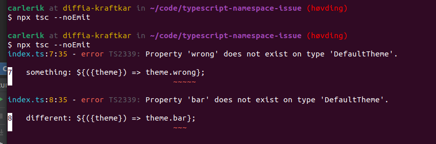

# Demonstrates creating a common interface for a Styled Components theme

## Intellisense and type checking working
> This is before using `Omit` to scope the theme down to the common props

## Typing complains (correctly) about using non-shared props
> This is after using `Omit` to scope the theme down to the common props

